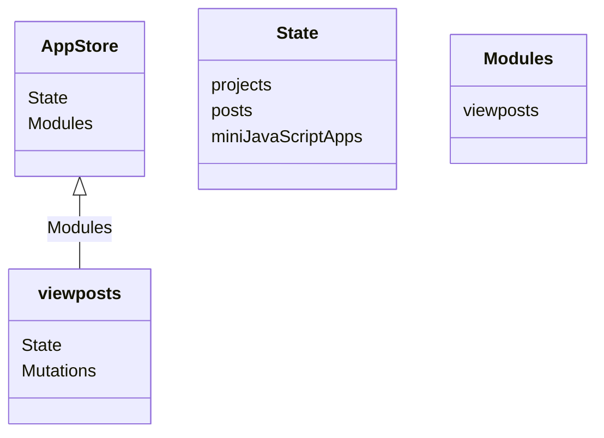
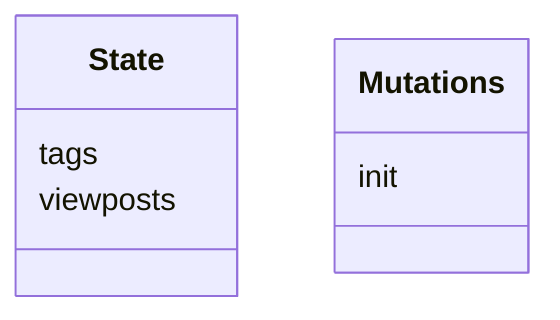
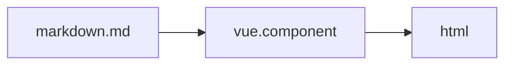

# site

source code for [my site](https://f2xiao.github.io/site)

# Development

App Store:



Modules viewposts:


## Post

markdown.md file is parsed by `markdown-it` and styled with `highlightjs`, mermaid graph is supported by `markdown-it-mermaid` 

NOTE: `markdown-it-mermaid` can only parse 'GRAPH' in the markdown file at this moment 

# Deployment


# License

The following directories and their contents are Copyright (c) 2023, Fangfang Xiao. You may not reuse anything therein without my permission:

```
posts/
src/assets
data.json
```

