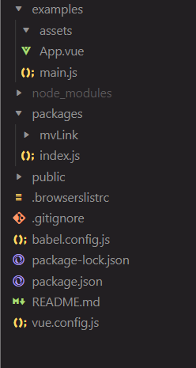
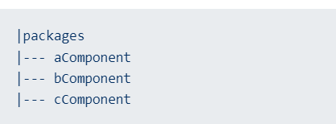

# Create a UI library for Vue
## Init project
### create a vue project with vue/cli
- project config: Babel and CSS pre-processor
### clean files
- delete src/components, assets/logo.png
- rename src to examples
- create a new folder called packages in the root

### Directory structure so far
After the above steps, the current directory structure looks like:

## Create a component
All components folders will be stored inside the folder called packages as follows:

files inside a single component should look like:

we define the component under `packages/<component-name>/src/index.vue`

## Expose the component
To see how to expose the component. First we need to understand there are three ways to register the components globally in Vue:
- register all as a package globally
- register a single component globally
- by CDN

### import all components
### import a single one
### import by CDN

## Build the UI library