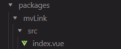

# Create a UI library for Vue
## Init project
### create a vue project with vue/cli
- project config: Babel and CSS pre-processor
### clean files
- delete src/components, assets/logo.png
- rename src to examples
- create a new folder called packages in the root

### Directory structure so far
After the above steps, the current directory structure looks like:


## Create a component
All components folders will be stored inside the folder called packages as follows:


Now, it's time to create a component. Let's start with a simple anchor tag component whose text color, text content and href can be passed:

``` js
var foo = function (bar) {
  return bar++;
};

console.log(foo(5));
```

Add props definitions and two pre-defined theme colors:
    

files inside a single component should look like:



we define the component under `packages/<component-name>/src/index.vue`

## Expose the component 
First, recall that to use a component in Vue, we need to first import it and then register it either globally or locally.


Since we want to build a UI library, import and register the component globally is a better solution. Vue provides a feature to add   see how to expose the component. First we need to understand there are three ways to import the components globally in Vue:
- import all as a package globally
- import a single component globally
- import by CDN

### import all components
under the component folder, only need vue component file which defines the component and  
### import a single one
### import by CDN

## Build the UI library