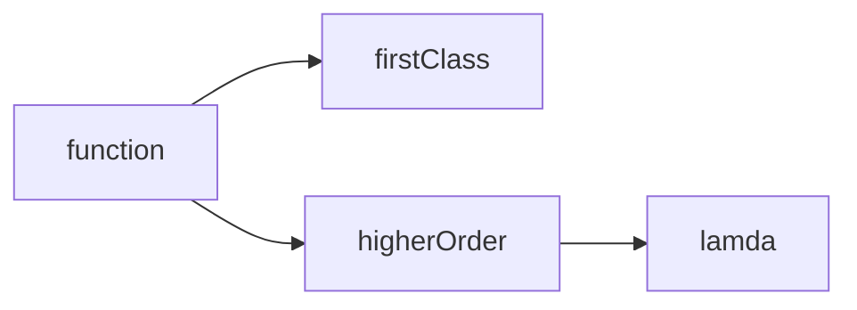

## Terminology

## Core Principles

avoid mutations and side effects

mutations: changing or altering things, such as function arguments or global variables
side effects: the outcome of mutations, i.e. the mutated function arguments or global variables

