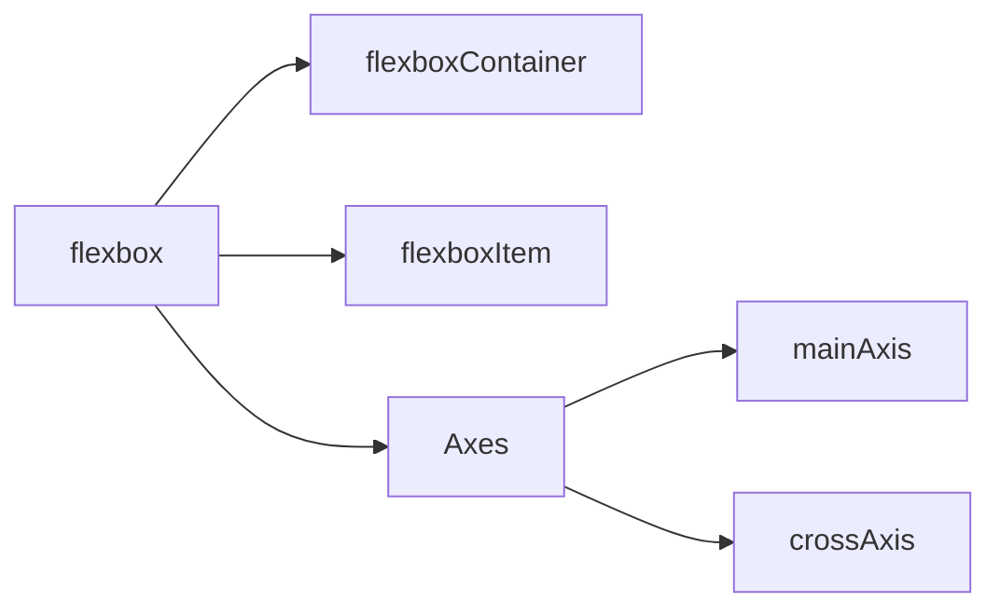
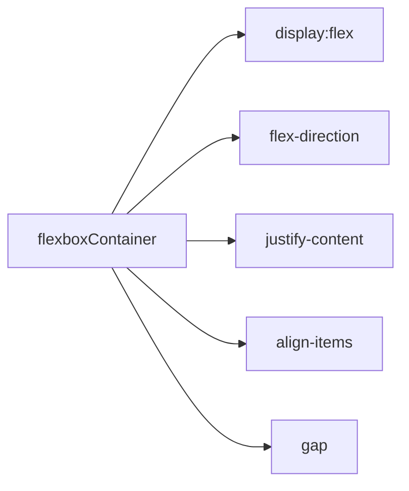
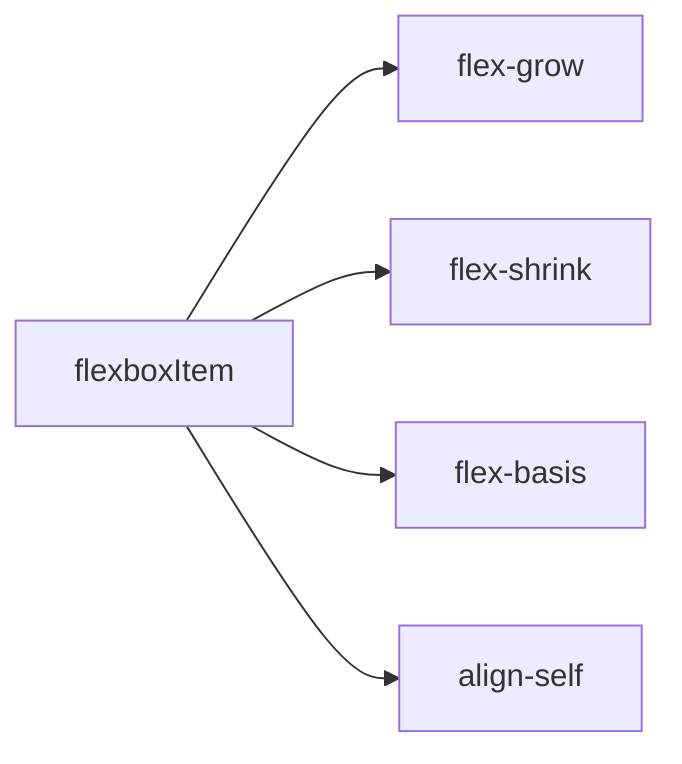

# Q & A
1. What is an HTML element?
  
    An HTML element is content wrapped in a pair of tags.

2. What is an attribute?
  
    An HTML attribute gives additional information to an HTML element and always goes in the element’s opening tag. An attribute is usually made up of two parts: a name, and a value; however, not all attributes require a value. In our case, we need to add a href (hyperlink reference) attribute to the opening anchor tag. The value of the href attribute is the destination we want our link to go to.

3. What are the four main image formats that you can use for images on the web?

    JPG images are good for photos.

    GIFs are good for animations.

    PNGs are good for diagrams and icons.

    SVGs are amazing. Use them wherever you can. SVG is a vector-based graphics format, meaning it can scale up or down to any dimension without loss of quality. 

4. What is flexbox?

    Flexbox is a way to arrange items into rows or columns. These items will flex (i.e. grow or shrink) based on some simple rules that you can define.

5. What’s the difference between a flex container and a flex item?

    A flexbox container is an element with CSS properties `display:flex` on it. Any element that lives directly inside a flexbox is a flexbox item.

6. What are the 3 values defined in the shorthand flex property (e.g. flex: 1 1 auto)?

    `flex-grow`, `flex-shrink`, `flex-basis`

7. What are the properties on flex container?

    `flex-direction`

# Flexbox Summary

flexbox objects:

flexbox container properties:

flexbox item properties:

